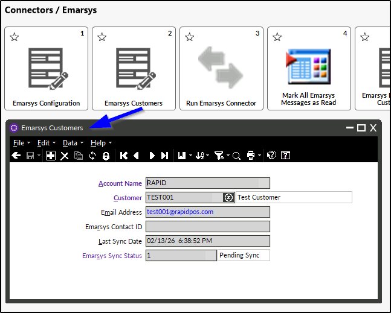
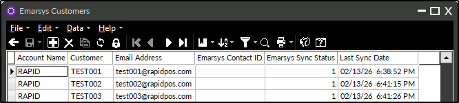
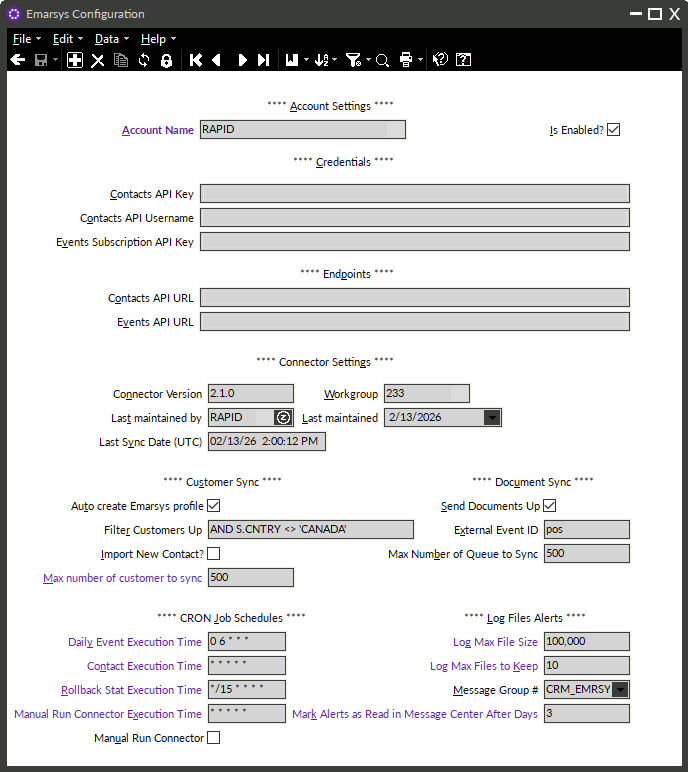
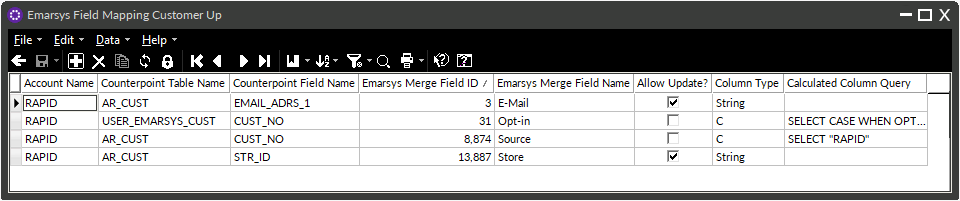
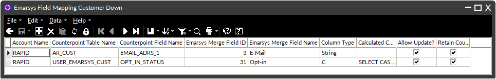
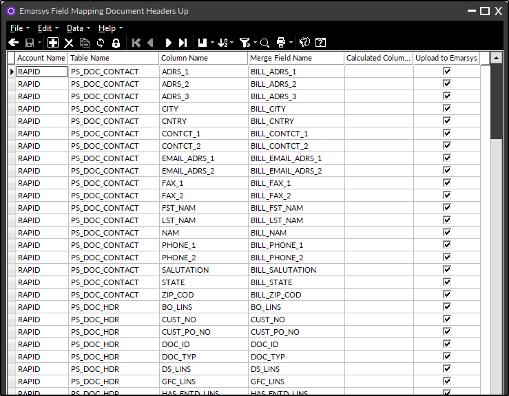
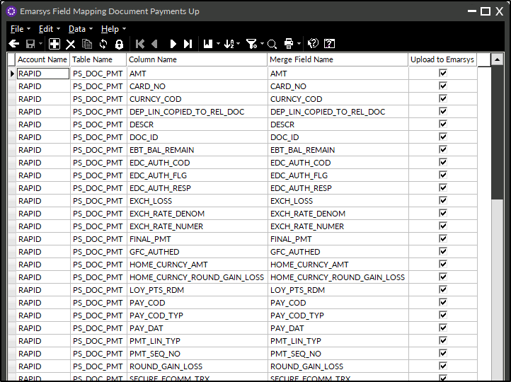
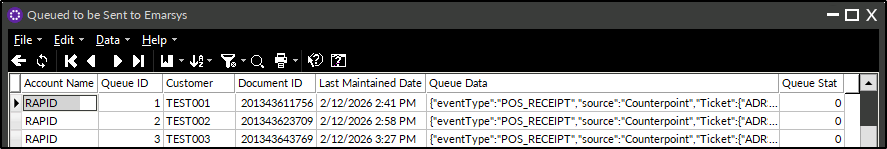

# Rapid POS Emarsys Connector - Version 2.1 
Updated 2/18/2026

---

## Overview

The Rapid Emarsys Connector automatically syncs customer and sales data from Counterpoint to Emarsys to support targeted email marketing. The connector syncs customer profiles and transaction information for customers with a populated **Email Address 1** in Counterpoint directly to Emarsys. Sales data is synced to a custom endpoint. 
  
Prior to considering this connector, please reach out to SAP Emarsys for a product quote.

---

## Minimum System Requirements

- Minimum Counterpoint version: **8.5.6.2**  
- Minimum SQL Server version: **2016**  
- Minimum Windows Server version: **2016**  
- Minimum PowerShell version: **5.1**  

If you would like the SAP Emarsys connector but your system does not meet these minimum requirements, please consult your Care Team Lead (vCIO) for an upgrade quote.

---

## Table of Contents

- [Minimum System Requirements](#minimum-system-requirements)
- [Section 1: Emarsys Customer Records](#section-1-emarsys-customer-records)
- [Section 2: Emarsys Configuration](#section-2-emarsys-configuration)
- [Section 3: Emarsys Field Mapping Customers Up](#section-3-emarsys-field-mapping-customers-up)
- [Section 4: Emarsys Field Mapping Document Headers Up](#section-4-emarsys-field-mapping-document-headers-up)
- [Section 5: Emarsys Field Mapping Document Lines Up](#section-5-emarsys-field-mapping-document-lines-up)
- [Section 6: Emarsys Field Mapping Document Payments Up](#section-6-emarsys-field-mapping-document-payments-up)
- [Section 7: Queued to Be Sent to Emarsys](#section-7-queued-to-be-sent-to-emarsys)
- [Section 8: Emarsys Customer Status View](#section-8-emarsys-customer-status-view)
- [Section 9: Run Emarsys Connector Button](#section-9-run-emarsys-connector-button)
- [Section 10: Mark All Emarsys Messages as Read](#section-10-mark-all-emarsys-messages-as-read)
- [Section 11: Emarsys Connector Execution and Sync Timing](#section-11-emarsys-connector-execution-and-sync-timing)
- [Section 12: Managing Customer Email and Phone Updates](#section-12-managing-customer-email-and-phone-updates)
- [Conclusion](#conclusion)

---

## SECTION 1: Emarsys Customer Records

In order for a Counterpoint customer to sync to Emarsys, an associated **Emarsys Customer Record** must exist in Counterpoint.

Depending on configuration settings (see **SECTION 2: Emarsys Configuration**), these records are usually created automatically for customers who have a populated **Email Address 1** in Counterpoint. 
- If automatic profile creation is disabled, Emarsys Customer Records must be created manually for each customer.

The Emarsys Customer Record contains:

- The email address (sourced from **Email Address 1** on the Counterpoint customer record)
- The Emarsys **Contact ID** (returned from Emarsys after the initial successful sync)
- The Emarsys **Opt-In Status** (returned from Emarsys after the initial sync as read-only field)
- The last sync date/time for that Emarsys customer record
- The current sync status

If the email address in **Email Address 1** does not meet valid email formatting requirements, the record will be flagged as invalid by Counterpoint, and it will not sync until corrected.

When a customer profile is successfully created or matched in Emarsys, the Emarsys **Contact ID** is immediately written back to Counterpoint.

### One-Time Sync Logic

Each Emarsys Customer Record is synced to Emarsys **once**, at the time the profile is first created or matched. 
- The connector does not push ongoing profile updates after this initial synchronization.

### Accessing Emarsys Customer Records

All Emarsys customer records can also be accessed from:

**Connectors > Emarsys > Emarsys Customer Records**

This view allows records to be displayed in **table view**, where filters can be applied to review customers based on their current sync status.

### Emarsys Sync Status Codes

Each Emarsys customer record includes a sync status value indicating its current state in the sync process:

- **0** – Fully synced; nothing pending  
- **1** – Recently created or updated; will sync on the next connector run  
- **2** – Profile is currently in the active sync queue  
- **5** – Invalid email address  
- **9** – Sync error; requires remediation before it can be re-synced

---

## SECTION 2: Emarsys Configuration

The Emarsys Connector includes a user interface for managing configuration options that control how the connector interacts with Emarsys and Counterpoint.  

For clients who use **multiple Emarsys accounts**, a separate configuration record will exist for each account.

### Account Name
- Identifies the Emarsys account.
- Especially important for companies with more than one Emarsys account (for example, separate accounts for a retail store and a restaurant).

### Is Enabled?
- Used to temporarily disable the connector while troubleshooting or testing.

### Credentials
Stores the authentication values required for the Emarsys connector.

- **Contact Sync Credentials** – API key and username used for customer profile (contact) synchronization.
- **Event Sync API Key** – API key used for transactional event (document/ticket) synchronization.

### Endpoints
Defines the service URLs used by the connector. Contacts and events are processed by separate Emarsys services and therefore require distinct endpoints.

- **Contact Endpoint** – Used for customer profile (contact) synchronization.
- **Event Endpoint** – Used for transactional event (document/ticket) synchronization.

### Connector Version
- Displays the currently installed version of the Emarsys Connector.  

### Workgroup ID
- Workgroup **233** will be created when the connector is installed. This is not currently used, but rather is related to functionality that may be developed in the future. See "Import New Contact?" below.

### Last Maintained By, Last Maintained
- Displays most recent maintenance information for reference.

### Last Customer Sync Date (UTC)
- Displays the most recent date a customer record was successfully synced to Emarsys.

### Auto Create Emarsys Profile
Controls whether or not Emarsys customer records are automatically created from Counterpoint.

- **Yes/Checked**  
  A Emarsys customer record is automatically created when a customer is added to Counterpoint with **Email Address 1**.
  - Customers pushed up to Emarsys are sent as "opt-in". 

- **No**  
  Emarsys customer records must be created manually.

### Filter Customers Up
If this filter is populated, then only the customers that meet the requirements of the defined filter will be pushed up to Emarsys.

### Max Customers to Sync
- Used to optimize connector performance.
- Defines the maximum number of customers that can be synced in a single connector run.

### Send Documents Up
- If set to yes/checked, documents (tickets) will be sent to the defined endpoint at ticket completion.
  - Note: The stored procedure that controls this functionality will automatically exclude sending tickets from stores with a Canadian address.
- If set to no/unchecked, no documents will be sent.

### External Event ID
- Required by the events endpoint. 

### Max Number of Queue to Sync
- Used to optimize connector performance.
- Defines the maximum number of documents (tickets) that can be synced in a single connector run.

### Other Configuration Options
Additional configuration fields exist for internal use by Rapid programmers. These options are used to optimize performance or assist with troubleshooting and should not be modified by end users.

### _PLACEHOLDER FOR FUTURE DEVELOPMENT:_ Import New Contact
Currently the connector **cannot** create (insert) new Counterpoint customer records. 
- _When developed_, this field will control whether Emarsys contacts can create new Counterpoint customer records.
  - If set to yes/checked, Emarsys contacts that do not match an existing Counterpoint customer will be inserted into Counterpoint.
  - If set to no/unchecked, new Counterpoint customer records will not be created by the connector.

---

## SECTION 3: Emarsys Field Mapping Customers Up

The **Emarsys Field Mapping Customers Up** screen provides a user interface for managing which customer fields are sent from Counterpoint up to Emarsys.

This table defines how customer profile data in Counterpoint maps to Emarsys profile properties. The standard deployment includes a predefined set of fields that are automatically synced. Adjustments to this table should generally be performed by a programmer.

Note: This is best viewed in _table view_.

Additional calculated fields are not included by default. Any request to add calculated fields must be reviewed and quoted separately by Rapid.

**Note:** **Email Address 1** is a required field and must be sent to Emarsys.

### Standard Customer Profile Fields Sent to Emarsys

The following customer fields are included in a standard Emarsys connector deployment:

1. Email Address 1 (Emarsys Field 3)
2. Opt-In Status (Emarsys Field 31, set to "opted-in" only when the connector creates a new Emarsys Contact, _see details below_)
3. Store ID (Emarsys Field 13887, set to the Counterpoint store ID only when the connector creates a new Emarsys Contact)
4. Source (Emarsys Field 8874, calculated field set to `Rapid` only when the connector creates a new Emarsys Contact)

Additional fields can be mapped by request.

### Opt-In Status and Initial Sync Behavior

Each Emarsys Customer Record is synced to Emarsys **once**. During this initial sync:

- If the email address does **not** already exist in Emarsys:
  - A new contact is created in Emarsys.
  - The opt-in status is set to **`Y`**, meaning **Yes**.
    - This sets **Emarsys Field 31** to **`1`**, meaning **`TRUE`**.
    - Emarsys evaluates this request and finalizes the opt-in status, which is then returned and stored in Counterpoint. 
  - The Emarsys **Contact ID** is returned and stored in Counterpoint.

- If the email address **already exists** in Emarsys:
  - The existing Emarsys contact is matched.
  - The Emarsys **Contact ID** is returned and stored in Counterpoint.
  - The opt-in status in Emarsys is **not modified**. The existing opt-in status of the contact is returned and stored in Counterpoint. 

This design ensures that new contacts are opted in upon creation while preventing unintended changes to existing subscription statuses in Emarsys.

---

## SECTION 4: Emarsys Field Mapping Customers Down

The **Emarsys Field Mapping Customers Down** screen provides a user interface for managing which customer fields are imported from Emarsys down into Counterpoint.

Currently the connector **cannot** create (insert) new Counterpoint customer records. This functionality is for updating values in Counterpoint (for reference) as part of the one-time contact sync. 

The standard deployment includes a predefined set of fields that are automatically synced. Adjustments to this table should generally be performed by a programmer.

Note: This is best viewed in _table view_.

Any request to add fields must be reviewed and quoted separately by Rapid.

### Standard Customer Profile Fields Imported into Counterpoint from Emarsys

The following fields are included in a standard Emarsys connector deployment:

1. Email Address 1 (Emarsys Field 3)
2. Opt-In Status (Emarsys Field 31, _see details in SECTION 3: Emarsys Field Mapping Customers Up, Opt-In Status and Initial Sync Behavior_)

Additional fields can be mapped by request.

Note: The **Emarsys Contact ID** is hard-coded to import into Counterpoint and is not listed on the field mapping for customers down.

---

## SECTION 5: Emarsys Field Mapping Document Headers Up

The **Emarsys Field Mapping Document Headers Up** screen provides a user interface for managing which document header fields are sent from Counterpoint up to Emarsys.

This table defines how document header data in Counterpoint maps to Emarsys event fields. The standard deployment includes a predefined set of fields that are automatically synced. Adjustments to this table should generally be performed by a programmer.

Note: This is best viewed in _table view_.

---

## SECTION 6: Emarsys Field Mapping Document Lines Up

The **Emarsys Field Mapping Document Lines Up** screen provides a user interface for managing which document line fields are sent from Counterpoint up to Emarsys.

This table defines how document line data in Counterpoint maps to Emarsys event fields. The standard deployment includes a predefined set of fields that are automatically synced. Adjustments to this table should generally be performed by a programmer.

Note: This is best viewed in _table view_.

---

## SECTION 7: Emarsys Field Mapping Document Payments Up

The **Emarsys Field Mapping Document Payments Up** screen provides a user interface for managing which document payment fields are sent from Counterpoint up to Emarsys.

This table defines how document line payment in Counterpoint maps to Emarsys event fields. The standard deployment includes a predefined set of fields that are automatically synced. Adjustments to this table should generally be performed by a programmer.

Note: This is best viewed in _table view_.

---

## SECTION 8: Queued to Be Sent to Emarsys

When sending transactional (document) data to Emarsys, each ticket is first placed into a queue in Counterpoint. Tickets are then synced from this queue to Emarsys during connector runs.

**Note:** Tickets are one type of document within Counterpoint. Currently this is the only document type pushed to Emarsys. (For example, orders and layaways are not sent to Emarsys.) Additionally, tickets from Canadian stores are excluded from synchronization. 

### Queue Status Values

Each document in the queue includes a status value indicating its current state in the sync process:

- **0** – Document has already been synced to Emarsys; nothing pending  
- **1** – Document has been recently created or updated and will be added to the queue on the next connector run  
- **2** – Document is currently in the active sync queue  
- **9** – Document encountered an error and requires remediation before it can be re-synced

---

## SECTION 9: Emarsys Customer Status View

Each Emarsys customer record includes a **sync status** that indicates its current state in the connector process. In some cases, it is helpful to review how many customer records fall into a particular status category.

For example, you may want to identify that **four customers have encountered an error (status 9)** so those records can be reviewed and corrected.

The **Emarsys Customer Status View** displays a summary table showing:
- Each sync status code (0, 1, 2, 5, 9)
- The total number of customer records currently associated with that status

**Notes:**
- If no customer records exist for a given status, that status will **not** appear in the table.
- The table can be refreshed at any time to display the most up-to-date information.
- This is best viewed in _table view_.

For details on the meaning of each customer sync status value, refer back to **SECTION 1: Emarsys Customer Records**.

---

## SECTION 10: Run Emarsys Connector Button

The **Run Emarsys Connector** menu option allows authorized users to manually trigger the Emarsys Connector when needed. Manual execution is typically used for testing or troubleshooting and is not required during normal operation.

### How Manual Execution Works

When the **Run Emarsys Connector** menu option is selected:

- A **Manual Run Connector** action flag is set in the Emarsys configuration.
- The flag functions as a **one-time execution request** and remains enabled until it is processed by the connector.
- Execution is handled in the background on the server (not on the workstation) to prevent overlapping executions.

### Background Processing and Scheduling

A background process periodically checks for the **Manual Run Connector** action flag based on a configurable **CRON schedule** stored in the Emarsys configuration.

- The **Manual Run Connector Execution Time** schedule can be configured from the **Emarsys Configuration** screen.
- When the action flag is detected:
  - If the Emarsys connector is **not currently running**, it will execute for **all configured Emarsys accounts**, typically within one minute.
  - If the connector **is already running**, the system waits for the current execution to complete, then automatically restarts the connector for all configured Emarsys accounts.

In both scenarios, the action flag is **automatically cleared** when execution begins.

**Important:** Manual execution is intended primarily for **programmer-led testing or troubleshooting**, often when the connector has been **temporarily disabled**. It is not designed for routine operational use, as the connector runs automatically according to its configured schedule.

---

## SECTION 11: Mark All Emarsys Messages as Read

The **Mark All Emarsys Messages as Read** menu option allows users to suppress repeated pop-up alerts in Counterpoint while retaining all Emarsys connector messages for later review.

This is especially useful in scenarios such as:
- Repeated error messages following a temporary internet outage
- High-volume alert conditions that have already been reviewed or acknowledged

Marking messages as read stops the pop-up notifications but does **not** delete the messages. All connector messages remain accessible in Counterpoint and can be reviewed at any time.

---

## SECTION 12: Emarsys Connector Execution and Sync Timing

The Emarsys Connector operates as a **Windows Service**, automatically syncing customer profiles between Counterpoint and Emarsys, and transactional documents between Counterpoint and a separate Events endpoint. 

The connector runs in the background and processes different types of data on **separate schedules** to optimize performance, manage API usage, and ensure reliable synchronization.

### Daily Event Execution Time

The following data is synced once per day according to the configured Daily Event Execution Time (default 6:00 AM):

- Marks Emarsys connector messages as read

### Contact Execution Time

The following data is synced once per day according to the configured Contact Event Execution Time (default every 1 minute):

- Syncs customer profile updates between Counterpoint and Emarsys.
- Syncs transactional documents (tickets) in the queue.

### Rollback Stat Execution Time

Runs periodically to ensure failed or interrupted sync attempts are retried automatically (default every 15 minutes):

- Identifies customers or queue items that did not successfully sync.
- Re-attempts synchronization for records still pending by checking for process IDs that do not match the active process ID.

### Manual Run Connector Execution Time

Supports the **Run Emarsys Connector** manual execution option (default every 1 minute):

- When triggered manually, the connector bypasses normal schedule timing and executes contact and queue synchronization services within a minute.
- Intended for testing or troubleshooting purposes.

---

## SECTION 13: Managing Customer Email and Phone Updates

When a customer is synced to Emarsys, the connector stores the associated **Emarsys Profile ID** on the customer record in Counterpoint. This Profile ID becomes the permanent link between the Counterpoint customer and the Emarsys profile and is used for all future updates.  

Using the Profile ID ensures that customer history, engagement data, events, and flow activity are preserved in Emarsys even when identifying information changes.

### Updating Email Address

If **Email Address 1** is updated in Counterpoint for a customer who already has a Emarsys profile:

- The connector updates the email address on the **existing Emarsys Profile ID**.
- A new Emarsys profile is **not** created.

This behavior ensures continuity in Emarsys while allowing customer contact information to be updated over time.

### Handling Duplicate Customer Records

The Emarsys Connector enforces strict rules to prevent **duplicate Emarsys profiles** and to maintain data integrity. Because Emarsys profiles are uniquely identified by email address (per Emarsys account), a single email address can only be associated with **one** Counterpoint customer record for that account.

The following scenarios describe how the connector behaves.

#### Scenario 1: Duplicate Email Addresses Already Exist in Counterpoint During Initial Setup

If the connector is installed and **multiple Counterpoint customers already share the same Email Address 1**:

- The connector creates or associates **one** Emarsys profile for that email address.
- Only one Counterpoint customer record can be linked to that Emarsys profile.
- Any additional Counterpoint customers using the same email address will **not** be able to create or associate their own Emarsys customer record for that email address.

This behavior is expected and prevents duplicate Emarsys profiles from being created during initial deployment.

#### Scenario 2: A Emarsys Customer Record Already Exists and the Same Email Is Assigned to Another Counterpoint Customer

If a Emarsys customer record already exists in Counterpoint for a given email address, and a user attempts to assign that **same Email Address 1** to a different Counterpoint customer record (either by editing an existing customer or creating a new one):

- Counterpoint blocks the action.
- An error is returned to the user.
- The connector does **not** allow a second Counterpoint customer to be linked to the same Emarsys profile.

This prevents multiple Counterpoint customer records from sharing a single Emarsys profile.

### Handling Merged Customers in Counterpoint

When two customer records are merged in Counterpoint:

- The Emarsys customer record associated with the **“To”** customer (the retained record) remains linked to the Emarsys profile.
- If the **“From”** customer had an associated Emarsys customer record, that record becomes detached from any active customer.

It is recommended to **manually delete** the detached Emarsys customer record after the merge. Otherwise, it will remain in Counterpoint with no functional association to an active Emarsys profile.

---

## Conclusion

The Rapid Emarsys Connector streamlines the exchange of customer profiles and transactional data between Counterpoint and Emarsys, enabling powerful email marketing.

For assistance with configuration changes, custom field mapping, or troubleshooting, contact Rapid Support.  
